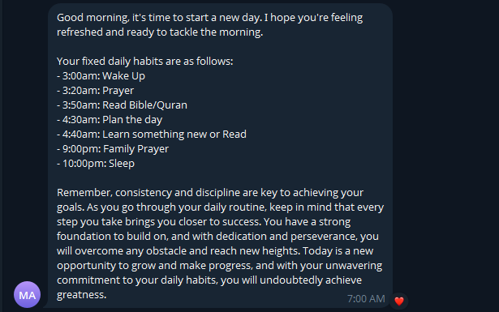
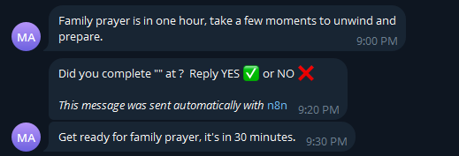
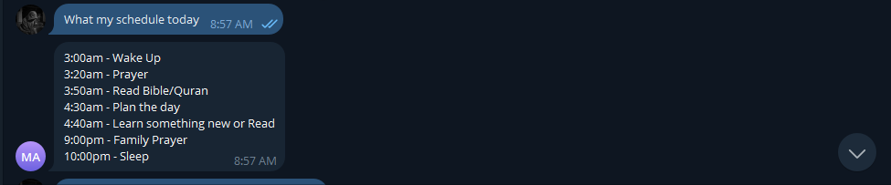
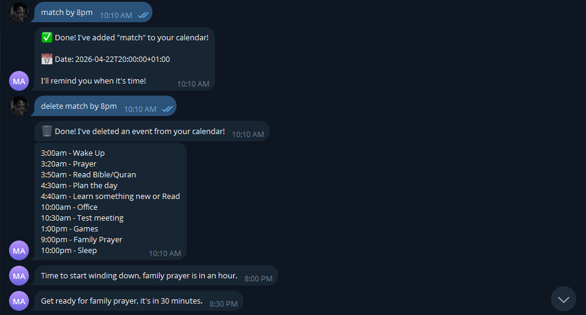
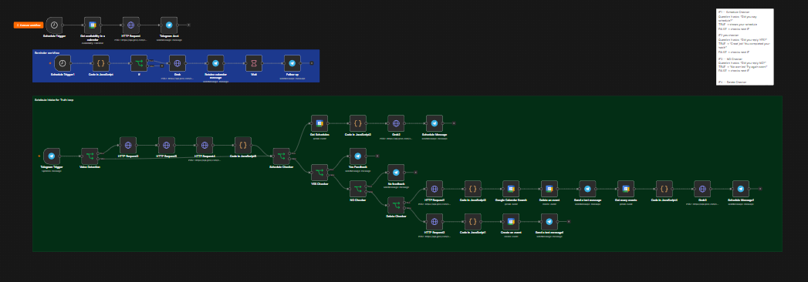
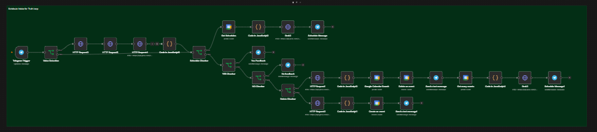

# AI Personal Assistant — Automated Productivity System

A fully automated personal assistant built with **n8n**, **Groq AI**, **Google Calendar API** and **Telegram Bot** that manages your schedule, tracks daily habits, sends intelligent reminders and responds to natural language text and voice commands — running 24/7 on Railway cloud.

> **Status: Live in production** — currently running as a personal productivity system.

---

## The Problem

Managing a disciplined daily routine is harder than it sounds:

- Phone reminders ping once and get swiped away with no accountability
- Manually adding calendar events requires opening apps and filling forms
- There is no system that follows up to check if you actually did the task
- Keeping track of your full day schedule requires opening multiple apps
- Voice-based task creation simply does not exist in free tools

## The Solution

A fully automated personal assistant built with **n8n**, **Groq AI** and **Google Calendar** that handles your entire daily productivity loop — from waking up to sleeping — automatically.

---

## Screenshots

### Morning Briefing — Telegram


### Habit Reminder — Telegram


### Schedule View — Telegram


### Add Event — Natural Language


### Delete Event — With Updated Schedule


### n8n — Morning Briefing Workflow


### n8n — Calendar Commands Workflow


---

## Features

### Morning Briefing
- Sends a personalised AI-written briefing every day at **2am automatically**
- Combines fixed daily habits with Google Calendar events for the day
- Warm, motivating and human-sounding — written fresh by Groq AI every morning
- Delivered directly to Telegram before you wake up

### Habit Reminder System
- Tracks **7 fixed daily habits** with custom times
- Sends reminders at **3 intervals** — 1 hour before, 30 minutes before, and on-time
- Runs every 30 minutes checking for upcoming habits
- Fully timezone-aware — supports Lagos, Nigeria (UTC+1)

### Natural Language Calendar Management

| Command | What Happens |
|---|---|
| `"Add meeting at 10am tomorrow"` | Creates event on Google Calendar |
| `"Delete gym at 7pm"` | Finds and deletes the event |
| `"What's my schedule today"` | Returns full day schedule |

### Voice Note Support
- Send a voice note to the Telegram bot
- Groq Whisper API transcribes it to text automatically
- Processed as a normal text command
- Create or delete calendar events completely hands-free

### Accountability Follow-Up
- After each habit the bot follows up:
  ```
  Did you complete "Prayer"? Reply YES or NO
  ```
- **YES** → motivating confirmation message
- **NO** → encouraging message to get back on track

### On-Demand Schedule
- Text `"what's my schedule today"` at any time
- Returns full schedule combining fixed habits and calendar events
- Listed in chronological order with correct timezone

---

## Tech Stack

| Tool | Purpose |
|---|---|
| **n8n** | Workflow automation engine |
| **Groq AI** (Llama 3.3 70B) | Natural language understanding and message generation |
| **Groq Whisper** | Voice note transcription |
| **Google Calendar API** | Calendar event management |
| **Telegram Bot API** | Notifications and command interface |
| **Railway** | Cloud hosting — 24/7 uptime |
| **JavaScript** | Custom logic in Code nodes |
| **OAuth 2.0** | Google authentication |

---

## System Architecture

```
Workflow 1 — Morning Briefing (runs at 2am daily)
Schedule Trigger → Google Calendar → Groq AI → Telegram

Workflow 2 — Habit Reminders (runs every 30 minutes)
Schedule Trigger → Code Node → IF → Groq AI → Telegram → Wait → Follow Up

Workflow 3 — Calendar Commands (listens 24/7)
Telegram Trigger
        ↓
Voice Detection
   ↓ Voice Note          ↓ Text Message
Get Telegram File        IF Chain
Download Audio               ↓
Groq Whisper          Is it "schedule"?  → Show Schedule
        ↓             Is it "YES"?       → Great Job Message
  Formatted Text       Is it "NO"?        → Try Again Message
        ↓             Is it "delete"?    → Find & Delete Event
     IF Chain          Everything else   → Create Calendar Event
```

---

## n8n Workflows

| Workflow | Purpose |
|---|---|
| Morning Briefing | Sends daily briefing at 2am + habit reminders every 30 mins |
| Calendar Commands | Handles all Telegram text and voice commands 24/7 |

---

## Key Design Decisions

**Why Telegram over WhatsApp?** Telegram bots are free and have a powerful API with no verification process. WhatsApp requires a paid Business API. For a personal productivity system this was the right trade-off.

**Why Groq over OpenAI?** Groq offers a generous free tier with 14,400 requests per day. OpenAI requires paid credits. For a personal system running hundreds of automations daily, Groq was the sustainable choice.

**Why n8n over Zapier or Make?** n8n is self-hosted which means no per-task pricing. For a system running continuously every 30 minutes, task-based pricing would become expensive quickly.

**Why Railway over local hosting?** Running n8n locally means the system only works when your PC is on. Railway keeps it running 24/7 in the cloud for approximately $2/month.

---

## Results

- ✅ Full daily schedule managed automatically without opening any app
- ✅ Habit reminders arrive at exactly the right time in Lagos timezone
- ✅ Calendar events created and deleted by typing or speaking naturally
- ✅ Accountability loop built in — no habit goes untracked
- ✅ Running 24/7 with ~$2/month hosting cost
- ✅ Zero manual work required after initial setup

---

## Roadmap

- [x] Morning briefing system
- [x] Habit reminder system (1hr, 30min, on-time)
- [x] Natural language calendar management
- [x] Voice note support
- [x] YES/NO accountability follow-up
- [x] View full schedule on demand
- [x] Delete events with updated schedule
- [ ] Weather in morning briefing
- [ ] End of day summary at 9pm
- [ ] Weekly review every Sunday
- [ ] Streak tracker for habits
- [ ] Multi-user support for family

---

## About

Built by **Muyideen Saka** — AI Automation Developer based in Lagos, Nigeria.

I build intelligent automation systems that eliminate manual work, run 24/7 and make productivity feel effortless.

- 📧 muyideensaka981@gmail.com
- 🐙 GitHub: [@Muyiez101](https://github.com/Muyiez101)

---

## License

This project is shared for portfolio purposes. The live system and credentials are not included in this repository.
